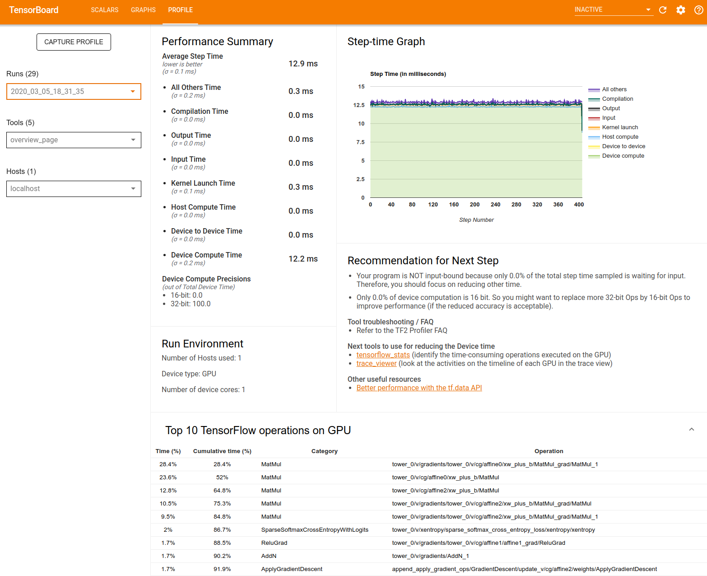
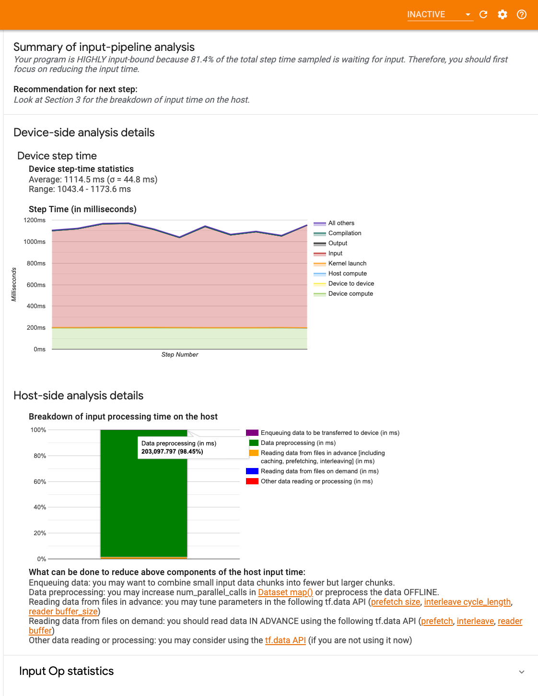
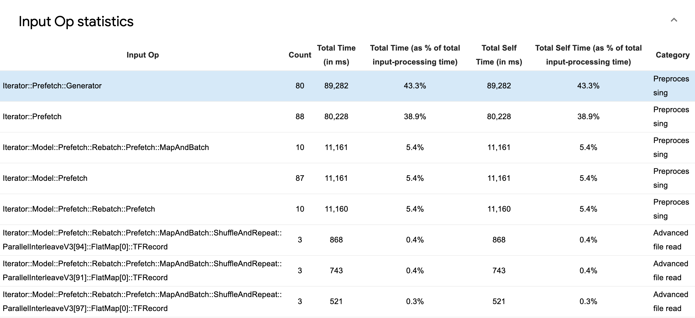
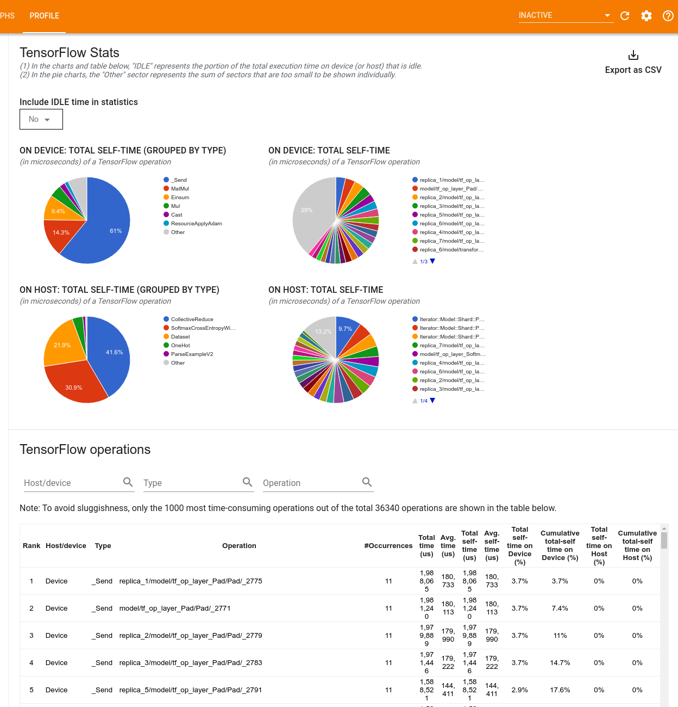
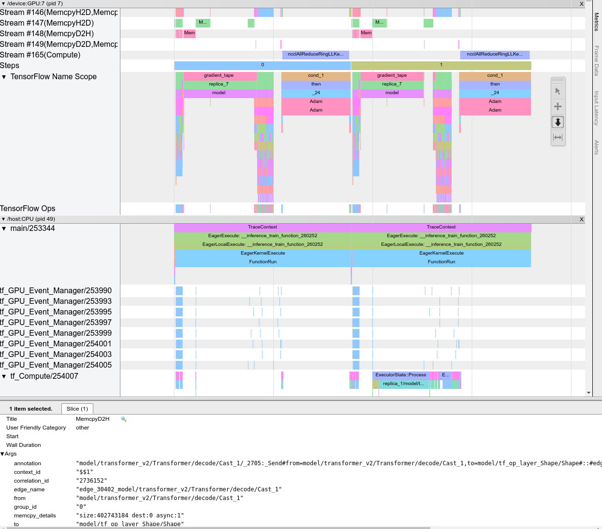
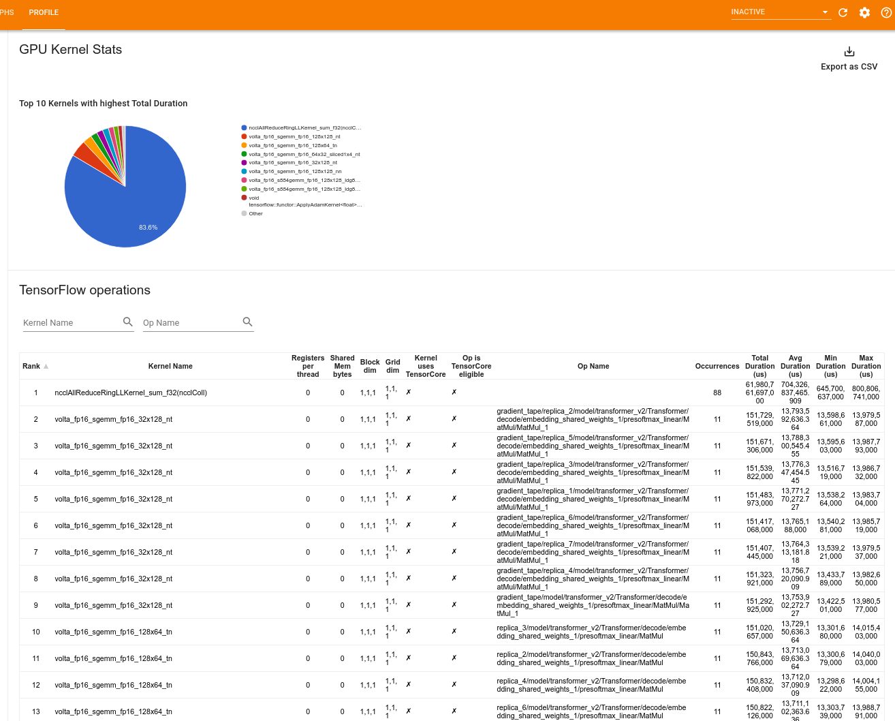
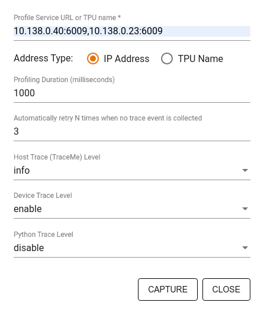

# Optimize TensorFlow performance using the Profiler

[TOC]

Use the tools available with the Profiler to track the performance of your
TensorFlow models. See how your model performs on the host (CPU), the device
(GPU), or on a combination of both the host and device(s).

Profiling helps you understand the hardware resource consumption (time and
memory) of the various TensorFlow operations (ops) in your model and resolve
performance bottlenecks and ultimately, make the model execute faster.

This guide will walk you through how to install the Profiler, the various tools
available, the different modes of how the Profiler collects performance data,
and some recommended best practices to optimize model performance.

If you want to profile your model performance on Cloud TPUs, refer to the
[Cloud TPU guide](https://cloud.google.com/tpu/docs/cloud-tpu-tools#capture_profile).

## Install the Profiler and GPU prerequisites

Install the Profiler by downloading and running the
[`install_and_run.py`](https://raw.githubusercontent.com/tensorflow/profiler/master/install_and_run.py)
script from the [GitHub repository](https://github.com/tensorflow/profiler).

To profile on the GPU, you must:

1.  Install CUDA® Toolkit 10.1 or newer. To profile multiple GPUs, install CUDA®
    Toolkit 10.2 or later. CUDA® Toolkit 10.1 supports only single GPU
    profiling.
1.  Ensure CUPTI exists on the path:

    *   Run `ldconfig -p | grep libcupti`

If you don't have CUPTI on the path, run:

```shell
export LD_LIBRARY_PATH=/usr/local/cuda/extras/CUPTI/lib64:$LD_LIBRARY_PATH
```

Run the `ldconfig` command above again to verify that the CUPTI library is
found.

To profile multi-worker GPU configurations, profile individual workers
independently.

## Profiler tools

Access the Profiler from the **Profile** tab in TensorBoard which appears only
after you have captured some model data. The Profiler has a selection of tools
to help with performance analysis:

-   Overview page
-   Input pipeline analyzer
-   TensorFlow stats
-   Trace viewer
-   GPU kernel stats

### Overview page

The overview page provides a top level view of how your model performed during a
profile run. The page shows you an aggregated overview page for your host and
all devices, and some recommendations to improve your model training
performance. You can also select individual hosts in the Host dropdown.

The overview page displays data as follows:



*   **Performance summary -** Displays a high-level summary of your model
    performance. The performance summary has two parts:

    1.  Step-time breakdown - Breaks down the average step time into multiple
        categories of where time is spent:

        *   Compilation - Time spent compiling kernels
        *   Input - Time spent reading input data
        *   Output - Time spent reading output data
        *   Kernel launch - Time spent by the host to launch kernels
        *   Host compute time
        *   Device-to-device communication time
        *   On-device compute time
        *   All others, including Python overhead

    2.  Device compute precisions - Reports the percentage of device compute
        time that uses 16 and 32-bit computations

*   **Step-time graph -** Displays a graph of device step time (in milliseconds)
    over all the steps sampled. Each step is broken into the multiple categories
    (with different colors) of where time is spent. The red area corresponds to
    the portion of the step time the devices were sitting idle waiting for input
    data from the host. The green area shows how much of time the device was
    actually working

*   **Top 10 TensorFlow operations on device -** Displays the on-device ops that
    ran the longest.

    Each row displays an op's self time (as the percentage of time taken by all
    ops), cumulative time, category, and name.

*   **Run environment -** Displays a high-level summary of the model run
    environment including:

    *   Number of hosts used
    *   Device type (GPU/TPU)
    *   Number of device cores

*   **Recommendation for next steps -** Reports when a model is input bound and
    recommends tools you can use to locate and resolve model performance
    bottlenecks

### Input pipeline analyzer

When a TensorFlow program reads data from a file it begins at the top of the
TensorFlow graph in a pipelined manner. The read process is divided into
multiple data processing stages connected in series, where the output of one
stage is the input to the next one. This system of reading data is called the
*input pipeline*.

A typical pipeline for reading records from files has the following stages:

1.  File reading
1.  File preprocessing (optional)
1.  File transfer from the host to the device

An inefficient input pipeline can severely slow down your application. An
application is considered **input bound** when it spends a significant portion
of time in input pipeline. Use the insights obtained from the input pipeline
analyzer to understand where the input pipeline is inefficient.

The input pipeline analyzer tells you immediately whether your program is input
bound and walks you through device- and host-side analysis to debug performance
bottlenecks at any stage in the input pipeline.

See the guidance on input pipeline performance for recommended best practices to
optimize your data input pipelines.

#### Input pipeline dashboard

To open the input pipeline analyzer, select **Profile**, then select
**input_pipeline_analyzer** from the **Tools** dropdown.



The dashboard contains three sections:

1.  **Summary -** Summarizes the overall input pipeline with information on
    whether your application is input bound and, if so, by how much
1.  **Device-side analysis -** Displays detailed, device-side analysis results,
    including the device step-time and the range of device time spent waiting
    for input data across cores at each step
1.  **Host-side analysis -** Shows a detailed analysis on the host side,
    including a breakdown of input processing time on the host

#### Input pipeline summary

The Summary reports if your program is input bound by presenting the percentage
of device time spent on waiting for input from the host. If you are using a
standard input pipeline that has been instrumented, the tool reports where most
of the input processing time is spent.

#### Device-side analysis

The device-side analysis provides insights on time spent on the device versus on
the host and how much device time was spent waiting for input data from the
host.

1.  **Step time plotted against step number -** Displays a graph of device step
    time (in milliseconds) over all the steps sampled. Each step is broken into
    the multiple categories (with different colors) of where time is spent. The
    red area corresponds to the portion of the step time the devices were
    sitting idle waiting for input data from the host. The green area shows how
    much of time the device was actually working
1.  **Step time statistics -** Reports the average, standard deviation, and
    range (\[minimum, maximum\]) of the device step time

#### Host-side analysis

The host-side analysis reports a breakdown of the input processing time (the
time spent on `tf.data` API ops) on the host into several categories:

-   **Reading data from files on demand -** Time spent on reading data from
    files without caching, prefetching, and interleaving.
-   **Reading data from files in advance -** Time spent reading files, including
    caching, prefetching, and interleaving
-   **Data preprocessing -** Time spent on preprocessing ops, such as image
    decompression
-   **Enqueuing data to be transferred to device -** Time spent putting data
    into an infeed queue before transferring the data to the device

Expand the **Input Op Statistics** to see the statistics for individual input
ops and their categories broken down by execution time.



A source data table appears with each entry containing the following
information:

1.  **Input Op -** Shows the TensorFlow op name of the input op
1.  **Count -** Shows the total number of instances of op execution during the
    profiling period
1.  **Total Time (in ms) -** Shows the cumulative sum of time spent on each of
    those instances
1.  **Total Time % -** Shows the total time spent on an op as a fraction of the
    total time spent in input processing
1.  **Total Self Time (in ms) -** Shows the cumulative sum of the self time
    spent on each of those instances. The self time here measures the time spent
    inside the function body, excluding the time spent in the function it calls.
1.  **Total Self Time %**. Shows the total self time as a fraction of the total
    time spent on input processing
1.  **Category**. Shows the processing category of the input op

### TensorFlow stats

The TensorFlow Stats tool displays the performance of every TensorFlow op (op)
that is executed on the host or device during a profiling session.



The tool displays performance information in two panes:

-   The upper pane displays upto four pie charts:

    1.  The distribution of self-execution time of each op on the host
    1.  The distribution of self-execution time of each op type on the host
    1.  The distribution of self-execution time of each op on the device
    1.  The distribution of self-execution time of each op type on the device

-   The lower pane shows a table that reports data about TensorFlow ops with one
    row for each op and one column for each type of data (sort columns by
    clicking the heading of the column). Click the Export as CSV button on the
    right side of the upper pane to export the data from this table as a CSV
    file.

    Note that:

    *   If any ops have child ops:

        *   The total "accumulated" time of an op includes the time spent inside
            the child ops
        *   The total "self" time of an op does not include the time spent
            inside the child ops

    *   If an op executes on the host:

        *   The percentage of the total self-time on device incurred by the op
            on will be 0
        *   The cumulative percentage of the total self-time on device upto and
            including this op will be 0

    *   If an op executes on the device:

        *   The percentage of the total self-time on host incurred by this op
            will be 0
        *   The cumulative percentage of the total self-time on host upto and
            including this op will be 0

You can choose to include or exclude Idle time in the pie charts and table.

### Trace viewer

The trace viewer displays a timeline that shows:

-   Durations for the ops that were executed by your TensorFlow model
-   Which part of the system (host or device) executed an op. Typically, the
    host executes input operations, preprocesses training data and transfers it
    to the device, while the device executes the actual model training

Trace viewer allows you to identify performance problems in your model, then
take steps to resolve them. For example, at a high level, you can identify
whether input or model training is taking the majority of the time. Drilling
down, you can identify which ops take the longest to execute.

Note that trace viewer is limited to 1 million events per device.

#### Trace viewer interface

When you open the trace viewer, it appears displaying your most recent run:



This screen contains the following main elements:

1.  **Timeline pane -** Shows ops that the device and the host executed over
    time
1.  **Details pane -** Shows additional information for ops selected in the
    Timeline pane

The Timeline pane contains the following elements:

1.  **Top bar -** Contains various auxiliary controls
1.  **Time axis -** Shows time relative to the beginning of the trace
1.  **Section and track labels -** Each section contains multiple tracks and has
    a triangle on the left that you can click to expand and collapse the
    section. There is one section for every processing element in the system
1.  **Tool selector -** Contains various tools for interacting with the trace
    viewer such as Zoom, Pan, Select, and Timing. Use the Timing tool to mark a
    time interval.
1.  **Events -** These show the time during which an op was executed or the
    duration of meta-events, such as training steps

##### Sections and tracks

The trace viewer contains the following sections:

-   **One section for each device node**, labeled with the number of the device
    chip and the device node within the chip (for example, `/device:GPU:0 (pid
    0)`). Each device node section contains the following tracks:
    -   **Step -** Shows the duration of the training steps that were running on
        the device
    -   **TensorFlow Ops -**. Shows the ops executed on the device
    -   **XLA Ops -** Shows [XLA](https://www.tensorflow.org/xla/) operations
        (ops) that ran on the device if XLA is the compiler used (each
        TensorFlow op is translated into one or several XLA ops. The XLA
        compiler translates the XLA ops into code that runs on the device).
-   **One section for threads running on the host machine's CPU,** labeled
    **"Host Threads"**. The section contains one track for each CPU thread.
    Note: You can ignore the information displayed alongside the section labels

##### Events

Events within the timeline are displayed in different colors; the colors
themselves have no specific meaning.

### GPU kernel stats

This tool shows performance statistics and the originating op for every GPU
accelerated kernel.



The tool displays information in two panes:

-   The upper pane displays a pie chart which shows the CUDA kernels that have
    the highest total time elapsed

-   The lower pane displays a table with the following data for each unique
    kernel-op pair:

    *   A rank in descending order of total elapsed GPU duration grouped by
        kernel-op pair
    *   The name of the launched kernel
    *   The number of GPU registers used by the kernel
    *   The total size of shared (static + dynamic shared) memory used in bytes
    *   The block dimension expressed as `blockDim.x, blockDim.y, blockDim.z`
    *   The grid dimensions expressed as `gridDim.x, gridDim.y, gridDim.z`
    *   Whether the op is eligible to use TensorCores
    *   Whether the kernel contains TensorCore instructions
    *   The name of the op that launched this kernel
    *   The number of occurrences of this kernel-op pair
    *   The total elapsed GPU time in microseconds
    *   The average elapsed GPU time in microseconds
    *   The minimum elapsed GPU time in microseconds
    *   The maximum elapsed GPU time in microseconds

## Collect performance data

The TensorFlow Profiler collects host activities and GPU traces of your
TensorFlow model. You can configure the Profiler to collect performance data
through either the programmatic mode or the sampling mode.

*   Programmatic mode using the TensorBoard Keras Callback
    (`tf.keras.callbacks.TensorBoard`)

    ```python
    # profile from batches 10 to 15
    tb_callback = tf.keras.callbacks.TensorBoard(log_dir=log_dir,
                                                 profile_batch='10, 15')
    # Train the model and use the TensorBoard Keras callback to collect
    # performance profiling data
    model.fit(train_data,
              steps_per_epoch=20,
              epochs=5,
              callbacks=[tensorboard_callback])
    ```

*   Programmatic mode using the `tf.profiler` Function API

    ```python
    tf.profiler.experimental.start('logdir')
    # Train the model here
    tf.profiler.experimental.stop()
    ```

*   Programmatic mode using the context manager

    ```python
    with tf.profiler.experimental.Profile('logdir'):
        # Train the model here
        pass
    ```

Note that running the profiler for too long can cause it to run out of memory.
It is recommended to profile no more than 10 steps at a time.

*   Sampling mode - Perform on-demand profiling by using
    `tf.profiler.experimental.server.start()` to start a gRPC server with your
    TensorFlow model run. After starting the gRPC server and running your model,
    you can capture a profile through the **Capture Profile** button in the
    TensorBoard profile plugin. Use the script in the Install profiler section
    above to launch a TensorBoard instance if it is not already running.

    As an example,

    ```python
    # Start a gRPC server at port 6009
    tf.profiler.experimental.server.start(6009)
    # ... TensorFlow program ...
    ```



You can specify the Profile Service URL or TPU name, the profiling duration, and
how many times you want the Profiler to retry capturing profiles if unsuccessful
at first.

## Best practices for optimal model performance

Use the following recommendations as applicable for your TensorFlow models to
achieve optimal performance.

In general, perform all transformations on the device and ensure that you use
the latest compatible version of libraries like cuDNN and Intel MKL for your
platform.

### Optimize the input data pipeline

An efficient data input pipeline can drastically improve the speed of your model
execution by reducing device idle time. Consider incorporating the following
best practices as detailed
[here](https://www.tensorflow.org/guide/data_performance) to make your data
input pipeline more efficient:

*   Prefetch data
*   Parallelize data extraction
*   Parallelize data transformation
*   Cache data in memory
*   Vectorize user-defined functions
*   Reduce memory usage when applying transformations

Additionally, try running your model with synthetic data to check if the input
pipeline is a performance bottleneck.

### Improve device performance

*   Increase training mini-batch size (number of training samples used per
    device in one iteration of the training loop)
*   Use TF Stats to find out how efficiently on-device ops run
*   Use `tf.function` to perform computations and optionally, enable the
    `experimental_compile` flag
*   Minimize host Python operations between steps and reduce callbacks.
    Calculate metrics every few steps instead of at every step
*   Keep the device compute units busy
*   Send data to multiple devices in parallel
*   Optimize data layout to prefer channels first (e.g. NCHW over NHWC). Certain
    GPUs like the NVIDIA® V100 perform better with a NHWC data layout.
*   Consider using 16-bit numerical representations such as `fp16`, the
    half-precision floating point format specified by IEEE or the Brain
    floating-point [bfloat16](https://cloud.google.com/tpu/docs/bfloat16) format
*   Consider using the
    [Keras mixed precision API](https://www.tensorflow.org/guide/keras/mixed_precision)
*   When training on GPUs, make use of the TensorCore. GPU kernels use the
    TensorCore when the precision is fp16 and input/output dimensions are
    divisible by 8 or 16 (for int8)

## Additional resources

*   See the end-to-end
    [TensorBoard profiler tutorial](https://www.tensorflow.org/tensorboard/tensorboard_profiling_keras)
    to implement the advice in this guide.
*   Watch the
    [Performance profiling in TF 2](https://www.youtube.com/watch?v=pXHAQIhhMhI)
    talk from the TensorFlow Dev Summit 2020.
